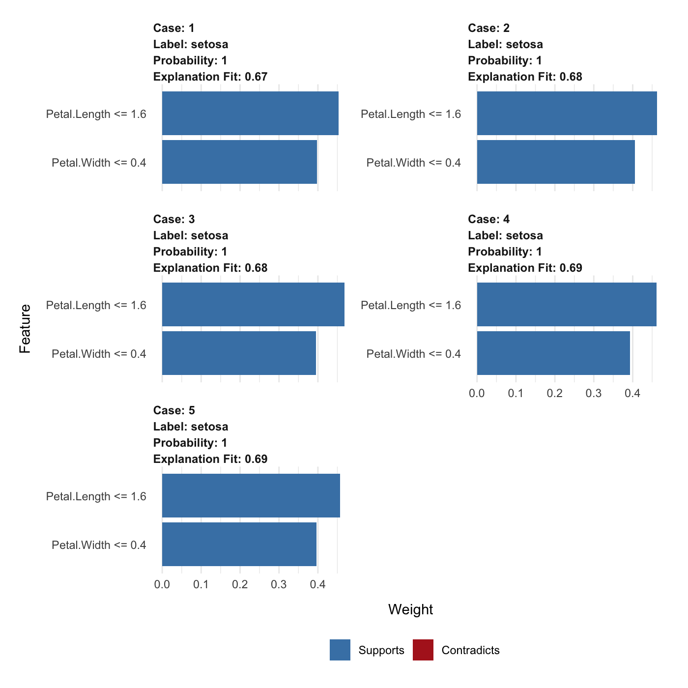

<!-- README.md is generated from README.Rmd. Please edit that file -->
lime 
=====================================================

[](https://travis-ci.org/thomasp85/lime) [](https://ci.appveyor.com/project/thomasp85/lime) [](https://CRAN.R-project.org/package=lime) [](https://CRAN.R-project.org/package=lime) [](https://codecov.io/github/thomasp85/lime?branch=master)

> There once was a package called lime,
>
> Whose models were simply sublime,
>
> It gave explanations for their variations,
>
> one observation at a time.

*lime-rick by Mara Averick*

------------------------------------------------------------------------

*This is an R port of the Python lime package (<https://github.com/marcotcr/lime>) developed by the authors of the lime (Local Interpretable Model-agnostic Explanations) approach for black-box model explanations. All credits for the invention of the approach goes to the original developers.*

The purpose of `lime` is to explain the predictions of black box classifiers. What this means is that for any given prediction and any given classifier it is able to determine a small set of features in the original data that has driven the outcome of the prediction. To learn more about the methodology of `lime` read the [paper](https://arxiv.org/abs/1602.04938) and visit the repository of the [original implementation](https://github.com/marcotcr/lime).

The `lime` package for R does not aim to be a line-by-line port of its Python counterpart. Instead it takes the ideas laid out in the original code and implements them in an API that is idiomatic to R.

An example
----------

Out of the box `lime` supports models created using the `caret` and `mlr` frameworks. Support for other models are easy to achieve by adding a `predict_model` and `model_type` method for the given model.

The following shows how a random forest model is trained on the iris data set and how `lime` is then used to explain a set of new observations:

``` r
library(caret)
library(lime)

# Split up the data set
iris_test <- iris[1:5, 1:4]
iris_train <- iris[-(1:5), 1:4]
iris_lab <- iris[[5]][-(1:5)]

# Create Random Forest model on iris data
model <- train(iris_train, iris_lab, method = 'rf')

# Create an explainer object
explainer <- lime(iris_train, model)

# Explain new observation
explanation <- explain(iris_test, explainer, n_labels = 1, n_features = 2)

# The output is provided in a consistent tabular format and includes the
# output from the model.
head(explanation)
#>       model_type case  label label_prob  model_r2 model_intercept
#> 1 classification    1 setosa          1 0.3893089       0.2316014
#> 2 classification    1 setosa          1 0.3893089       0.2316014
#> 3 classification    2 setosa          1 0.3761211       0.2415476
#> 4 classification    2 setosa          1 0.3761211       0.2415476
#> 5 classification    3 setosa          1 0.3644597       0.2520788
#> 6 classification    3 setosa          1 0.3644597       0.2520788
#>   model_prediction      feature feature_value feature_weight
#> 1        0.6932961  Sepal.Width           3.5    0.008767470
#> 2        0.6932961  Petal.Width           0.2    0.452927250
#> 3        0.6781473  Sepal.Width           3.0   -0.001619227
#> 4        0.6781473  Petal.Width           0.2    0.438218945
#> 5        0.6917634 Sepal.Length           4.7   -0.006370576
#> 6        0.6917634 Petal.Length           1.3    0.446055088
#>               feature_desc               data prediction
#> 1        3.3 < Sepal.Width 5.1, 3.5, 1.4, 0.2    1, 0, 0
#> 2       Petal.Width <= 0.4 5.1, 3.5, 1.4, 0.2    1, 0, 0
#> 3 2.8 < Sepal.Width <= 3.0 4.9, 3.0, 1.4, 0.2    1, 0, 0
#> 4       Petal.Width <= 0.4 4.9, 3.0, 1.4, 0.2    1, 0, 0
#> 5      Sepal.Length <= 5.2 4.7, 3.2, 1.3, 0.2    1, 0, 0
#> 6      Petal.Length <= 1.6 4.7, 3.2, 1.3, 0.2    1, 0, 0

# And can be visualised directly
plot_features(explanation)
```



`lime` also supports explaining text model and putting the explanation in the context of the original text input. It even includes a `shiny` application for interactively exploring text models:


Installation
------------

`lime` is available on CRAN and can be installed using the standard approach:

``` r
install.packages('lime')
```

To get the development version, install from GitHub instead:

``` r
# install.packages('devtools')
devtools::install_github('thomasp85/lime')
```

Scope
-----

The current version of `lime` has support for tabular and text data. The Python implementation has additional support for image data, which will be added to this package in time. In addition to the capabilities discussed in the *"Why Should I Trust You?": Explaining the Predictions of Any Classifier* article, this package also support regression model explanations (this has been added to the Python library as well). The global model explanation using submodular picks that the article discusses is not supported in either packages. It might get support once it appears in the Python version and it is clear how the authors envision it.
