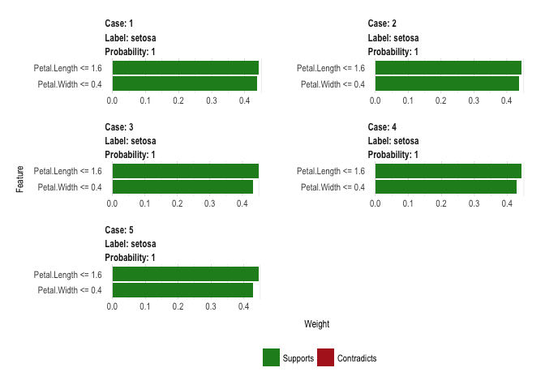

<!-- README.md is generated from README.Rmd. Please edit that file -->
lime
====

[](https://travis-ci.org/thomasp85/lime) [](https://ci.appveyor.com/project/thomasp85/lime) [](https://CRAN.R-project.org/package=lime) [](https://CRAN.R-project.org/package=lime)

*This is an R port of the Python lime package (<https://github.com/marcotcr/lime>) developed by the authors of the lime (Local Interpretable Model-agnostic Explanations) approach for black-box model explanations. All credits goes to the original developers.*

The purpose of `lime` is to explain the predictions of black box classifiers. What this means is that for any given prediction and any given classifier it is able to determine a small set of features in the original data that has driven the outcome of the prediction. To learn more about the methodology of `lime` read the [paper](https://arxiv.org/abs/1602.04938) and visit the repository of the [original implementation](https://github.com/marcotcr/lime).

The `lime` package for R does not aim to be a line-by-line port of its Python counterpart. Instead it takes the ideas laid out in the original code and implements them in an API that is idiomatic to R.

An example
----------

Out of the box `lime` supports models created using the `caret` and `mlr` frameworks. Support for other models are easy to achieve by adding a `predict_model` and `model_type` method for the given model.

The following shows how a random forest model is trained on the iris data set and how `lime` is then used to explain a set of new observations:

``` r
library(caret)
library(lime)

# Split up the data set
iris_test <- iris[1:5, 1:4]
iris_train <- iris[-(1:5), 1:4]
iris_lab <- iris[[5]][-(1:5)]

# Create Random Forest model on iris data
model <- train(iris_train, iris_lab, method = 'rf')

# Create an explainer object
explainer <- lime(iris_train, model)

# Explain new observation
explanation <- explain(iris_test, explainer, n_labels = 1, n_features = 2)

# The output is provided in a consistent tabular format and includes the
# output from the model.
head(explanation)
#> # A tibble: 6 x 12
#>       model_type  case  label label_prob  model_r2 model_intercept
#>            <chr> <chr>  <chr>      <dbl>     <dbl>           <dbl>
#> 1 classification     1 setosa          1 0.7356599       0.1032045
#> 2 classification     1 setosa          1 0.7356599       0.1032045
#> 3 classification     2 setosa          1 0.7183936       0.1076762
#> 4 classification     2 setosa          1 0.7183936       0.1076762
#> 5 classification     3 setosa          1 0.7303043       0.1033206
#> 6 classification     3 setosa          1 0.7303043       0.1033206
#> # ... with 6 more variables: feature <chr>, feature_value <dbl>,
#> #   feature_weight <dbl>, feature_desc <chr>, data <list>,
#> #   prediction <list>

# And can be visualised directly
plot_features(explanation)
```



Installation
------------

`lime` is still a work in progress and is thus not available on CRAN yet. In order to try it out install it directly from GitHub:

``` r
# install.packages('devtools')
devtools::install_github('thomasp85/lime')
```

Scope
-----

The current version of `lime` has support for tabular and text data. The Python implementation has additional support for image data, which will be added to this package in time. In addition to the capabilities discussed in the *"Why Should I Trust You?": Explaining the Predictions of Any Classifier* article, this package also support regression model explanations (this has been added to the Python library as well). The global model explanation using submodular picks is not supported in either packages.
