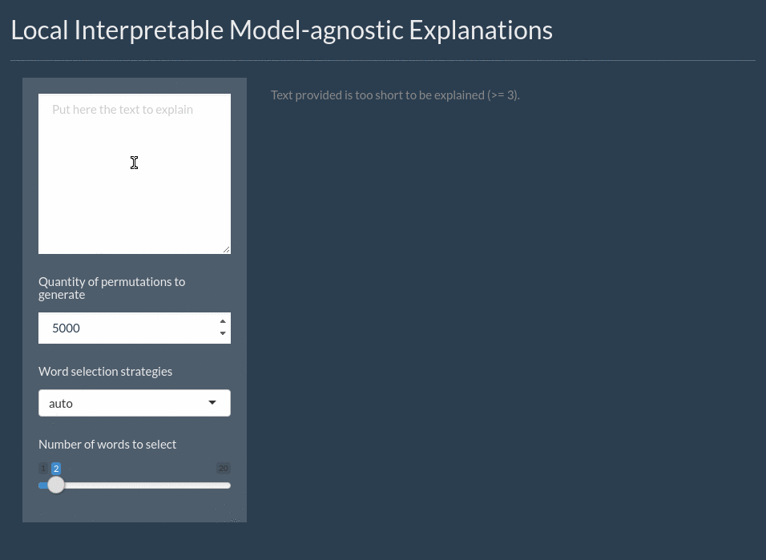

In order to be able to understand the explanations produced by `lime` it is 
necessary to have at least some knowledge of how these explanations are 
achieved. To this end, you are encouraged to read through 
[the article](https://arxiv.org/abs/1602.04938) that introduced the lime 
framework as well as the additional resources linked to from the original 
[Python repository](https://github.com/marcotcr/lime). This vignette will 
provide an overview to allow you to get up to speed on the framework and let you 
efficiently understand the output it produces.

## How lime explains stuff
Behind the workings of lime lies the (big) assumption that every complex model
is linear on a local scale. While this is not justified in the paper it is not 
difficult to convince yourself that this is generally sound — you usually expect 
two very similar observations to behave predictably even in a complex model. 
`lime` then takes this assumption to its natural conclusion by asserting that it
is possible to fit a simple model around a single observation that will mimic
how the global model behaves at that locality. The simple model can then be used
to explain the predictions of the more complex model locally. 

The general approach `lime` takes to achieving this goal is as follows:

1. For each prediction to explain, permute the observation `n` times.
2. Let the complex model predict the outcome of all permuted observations.
3. Calculate the distance from all permutations to the original observation.
3. Convert the distance to a similarity score.
4. Select `m` features best describing the complex model outcome from the 
   permuted data.
5. Fit a simple model to the permuted data, explaining the complex model outcome
   with the `m` features from the permuted data weighted by its similarity to 
   the original observation.
6. Extract the feature weights from the simple model and use these as 
   explanations for the complex models local behavior.

It is clear from the above that there's much wiggle-room in order to optimize 
the explanation. Chief among the choices that influence the quality of the 
explanation is how permutations are created, how permutation similarity is
calculated, how, and how many, features are selected, and which model is used as
the simple model. Some of these choices are hard-coded into `lime`, while others
can be influenced by the user — all of them will be discussed below.

### How to permute an observation
When it comes to permuting an observation, `lime` depends on the type of input
data. Currently two types of inputs are supported: *tabular* and *text*

**Tabular Data**  
When dealing with tabular data, the permutations are dependent on the training
set. During the creation of the explainer the statistics for each variable are
extracted and permutations are then sampled from the variable distributions. 
This means that permutations are in fact independent from the explained variable
making the similarity computation even more important as this is the only thing
establishing the locality of the analysis.

**Text Data**  
When the outcome of text predictions are to be explained the permutations are
performed by randomly removing words from the original observation. Depending on
whether the model uses word location or not, words occurring multiple times will
be removed one-by-one or as a whole.

### Calculating similarities with permutations
Just as permutations are created differently based on the input data, so the 
similarities are calculated in different ways. For text data the cosine 
similarity measure is used, which is the standard in text analysis (it
effectively measures the angle difference between the two feature vectors). For
tabular data a bit more thought is required and the optimal solution will depend
on the type of input data. First, the categorical features will be recoded based
on whether or not they are equal to the observation. Second, if continuous 
features are binned (the default) these features will be recoded based on 
whether they are in the same bin as the observation. Using the recoded data
the distance to the original observation is then calculated based on a 
user-chosen distance measure (euclidean by default), and converted to a 
similarity using an exponential kernel of a user defined width (defaults to 0.75 
times the square root of the number of features).

### Selecting the features to use
Feature selection is a complete sub-field of modelling in itself and `lime` has
no silver bullet for this. Instead, it implements a range of different feature
selection approaches that the user is free to choose from. First though, the 
number of features needs to be chosen. The number must strike a balance between
the complexity of the model and the simplicity of the explanation, but try to
keep it below 10 (personal opinion). As for selecting the features, `lime` 
supports the following algorithms:

- **none:** Use all features for the explanation. Not advised unless you have 
  very few features.
- **forward selection:** Features are added one by one based on their 
  improvements to a ridge regression fit of the complex model outcome.
- **highest weights:** The `m` features with highest absolute weight in a ridge
  regression fit of the complex model outcome are chosen.
- **lasso:** The `m` features that are least prone to shrinkage based on the 
  regularization path of a lasso fit of the complex model outcome is chosen.
- **tree:** A tree is fitted with `log2(m)` splits, to use at max `m` features. 
  It may possibly select less.
- **auto:** Uses forward selection if `m <= 6` and otherwise highest weights.

### Fitting a model to the permuted and feature-reduced data
Once permutations have been created, similarities calculated and features 
selected it is time to fit a model. If the complex model is a regressor, 
the simple model will predict the output of the complex model directly. If the
complex model is a classifier, the simple model will predict the probability of
the chosen class (for classifiers it is possible to either specify the classes
to explain, or let `lime` chose the top `k` most probable classes).

The only requirement for the simple model is that it can work with weighted 
input and that it is easy to extract understanding from the resulting fit. While
multiple types of models support this, `lime` uses a ridge regression as the
model of choice. In the future this might be expanded to other types of models.

## An example - Tabular Data
The following is a simple example which seeks to explain the outcome of a model 
predicting cancer based on biopsy results:

```{r}
library(MASS)
library(lime)
data(biopsy)

# First we'll clean up the data a bit
biopsy$ID <- NULL
biopsy <- na.omit(biopsy)
names(biopsy) <- c('clump thickness', 'uniformity of cell size', 
                   'uniformity of cell shape', 'marginal adhesion',
                   'single epithelial cell size', 'bare nuclei', 
                   'bland chromatin', 'normal nucleoli', 'mitoses',
                   'class')

# Now we'll fit a linear discriminant model on all but 4 cases
set.seed(4)
test_set <- sample(seq_len(nrow(biopsy)), 4)
prediction <- biopsy$class
biopsy$class <- NULL
model <- lda(biopsy[-test_set, ], prediction[-test_set])
```

If we use the model to predict the 4 remaining cases we get some pretty solid
predictions:

```{r}
predict(model, biopsy[test_set, ])
```

But lets see how these predictions came to be, using lime.

```{r}
explainer <- lime(biopsy[-test_set,], model, bin_continuous = TRUE, quantile_bins = FALSE)
explanation <- explain(biopsy[test_set, ], explainer, n_labels = 1, n_features = 4)
# Only showing part of output for better printing
explanation[, 2:9]
```

We can see that all the explanations for a *benign* outcome have chosen the same
features, strongly indicating that these are both locally and globally important
features. In order to get a more intuitive representation, we can use the 
provided `plot_features()` to get a visual overview of the explanations.

```{r, fig.asp=1.25, out.width='70%', fig.width=6, fig.align='center'}
plot_features(explanation, ncol = 1)
```

In this overview it is clear to see how case 195 and 416 behave alike, while
the third *benign* case (7) has an unusual large *bare nuclei* which are 
detracting from its status as *benign* without affecting the final prediction 
(indicating that the values of its other features are making up for this odd 
one). To no surprise it is clear that high values in the measurements are 
indicative of a *malignant* tumor.

## An example - text data
The following is a simple example which seeks to explain the outcome of a model 
classifying sentences from 30 scientific papers as being about (or not) the 
author’s own work, e.g. methods, results or conclusions.

Most of the things written for `data.frame` can be applied to textual data.

```{r}
library(lime)
library(xgboost) # the classifier
library(text2vec) # used to build the BoW matrix

# load data
data(train_sentences)
data(test_sentences)

# Data are stored in a 2 columns data.frame, one for the sentences, one for the 
# labels.
print(str(train_sentences))

# The list of possible classes for a sentence
# We are only interested in the class "OWNX"
print(unique(train_sentences$class.text))

# Tokenize data
get_matrix <- function(text) {
  it <- itoken(text, progressbar = FALSE)
  create_dtm(it, vectorizer = hash_vectorizer())
}

# BoW matrix generation
dtm_train = get_matrix(train_sentences$text)
dtm_test = get_matrix(test_sentences$text)

# Create boosting model for binary classification (-> logistic loss)
# Other parameters are quite standard
param <- list(max_depth = 7, 
              eta = 0.1, 
              objective = "binary:logistic", 
              eval_metric = "error", 
              nthread = 1)

xgb_model <- xgb.train(
  param, 
  xgb.DMatrix(dtm_train, label = train_sentences$class.text == "OWNX"),
  nrounds = 50
)
```

We will test our model on test data.

```{r}
# We use a (standard) threshold of 0.5
predictions <- predict(xgb_model, dtm_test) > 0.5
test_labels <- test_sentences$class.text == "OWNX"

# Accuracy
print(mean(predictions == test_labels))
```

Now we are sure that the model works, we may want to understand 
what are the most important words for the predictions.

```{r, fig.asp=1, out.width='70%', fig.width=6, fig.align='center'}
# We select 10 sentences from the label OWNX
sentence_to_explain <- head(test_sentences[test_labels,]$text, 5)
explainer <- lime(sentence_to_explain, model = xgb_model, 
                  preprocess = get_matrix)
explanation <- explain(sentence_to_explain, explainer, n_labels = 1, 
                       n_features = 2)

# Most of the words choosen by Lime
# are related to the team (we, our)
# or part of the paper (Section, in)
explanation[, 2:9]

# Another more graphical view of the same information (2 first sentences only)
plot_features(explanation)
```

The graph view gives lots of detailed information about the selected words.
Another approach to explain a text classification model is to see 
the most important words in their context.

```{r}
plot_text_explanations(explanation)
```

For some sentences, the prediction is wrong. For instance, look at the third 
sentence. The word *we* is in red and the predicted label is 0 (with a low 
probability), meaning the model thinks it's not a sentence from the category 
`OWNX`, mainly because of the presence of the word *those* but the word *we* in 
red doesn't support this (false) prediction.

## Interactive text model explanations

Text explanations are also available through `shine` to explore interactively the model.

After loading the application, both text and parameters can be modified.
Prediction and selected words are updated in real time.

```{r eval=FALSE}
# Launching the application is done in one command
interactive_text_explanations(explainer)
```

{width=700px}

## Session Info
```{r, echo=FALSE}
sessioninfo::session_info()
```

